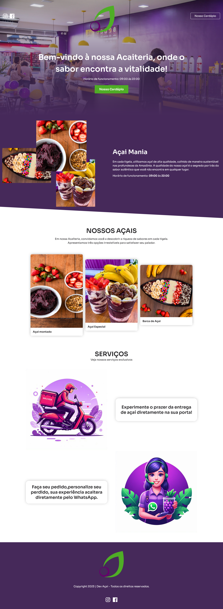

# Açai Mania - Sua Açaiteria

Bem-vindo ao repositório do projeto Açai Mania. Este é um site para uma Acaiteria fictícia, apresentando informações sobre os produtos, horário de funcionamento, opções de açaí e serviços oferecidos.

## Tecnologias Utilizadas

- HTML
- CSS (Sass)
- JavaScript

## Bibliotecas e Frameworks

- [AOS](https://github.com/michalsnik/aos) - Biblioteca para animações de scroll
- [Font Awesome](https://fontawesome.com/) - Ícones e fontes
- [Google Fonts](https://fonts.google.com/) - Fontes personalizadas

## Como Executar o Projeto

1. Clone o repositório: `git clone https://github.com/seu-usuario/nome-do-repositorio.git`
2. Abra o arquivo `index.html` em seu navegador.

## Estrutura do Projeto

- `index.html` - Página principal do site
- `style.css` - Estilos do site, gerados a partir do Sass
- `script.js` - Lógica de script para interatividade

## Contato

- Email: devmarcoslkd@gmail.com
- LinkedIn: [Marcos Almeida](https://www.linkedin.com/in/marcos-araujo-28b563292/)
